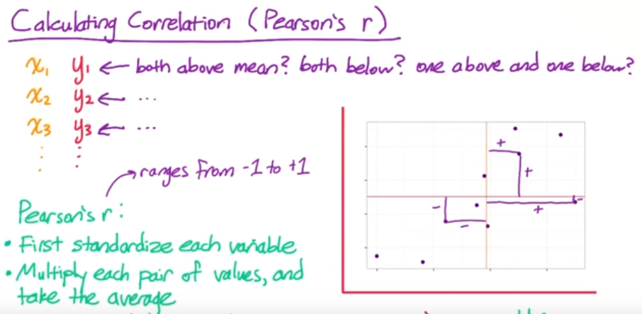

```python
import sys
sys.version
```


    '2.7.12 |Continuum Analytics, Inc.| (default, Jun 29 2016, 11:07:13) [MSC v.1500 64 bit (AMD64)]'


# Subway data


## Possible questions
- What variables are related to subway ridership?
  - which stations have most riders? 
  - what are the ridership patterns over time? 
      - will I able to see rush hours? 
      - how about holidays and Sundays? 
- what patterns can I find in the wether?
    - is the temperature rising throughout the month? 
        - global warming? 
    - how does weather vary accross the city?

## two-dimentional data
- Python: list of lists
- NumPy: 2D array  <-- **let's start here!**
- Pandas: DataFrame

2D arrays, as opposed to array of ararys:
- more memory efficient
- accesing elements is a bit different
    - a[1,3] rather than a[1][3]
- mean(), std(), etc. operate on entire array

### Quiz:
1. Find the max riders on the first day
2. Find the mean riders per day


```python
import numpy as np
```


```python

# Subway ridership for 5 stations on 10 different days
ridership = np.array([
    [   0,    0,    2,    5,    0],
    [1478, 3877, 3674, 2328, 2539],
    [1613, 4088, 3991, 6461, 2691],
    [1560, 3392, 3826, 4787, 2613],
    [1608, 4802, 3932, 4477, 2705],
    [1576, 3933, 3909, 4979, 2685],
    [  95,  229,  255,  496,  201],
    [   2,    0,    1,   27,    0],
    [1438, 3785, 3589, 4174, 2215],
    [1342, 4043, 4009, 4665, 3033]
])

# Change False to True for each block of code to see what it does

# Accessing elements
if False:
    print 'Accessing elements:'
    print ridership[1, 3]
    print ridership[1:3, 3:5]
    print ridership[1, :]
    
# Vectorized operations on rows or columns
if False:
    print '\nVectorized operations on rows or columns:'
    print ridership[0, :] + ridership[1, :]
    print ridership[:, 0] + ridership[:, 1]
    
# Vectorized operations on entire arrays
if False:
    print '\nVectorized operations on entire arrays:'
    a = np.array([[1, 2, 3], [4, 5, 6], [7, 8, 9]])
    b = np.array([[1, 1, 1], [2, 2, 2], [3, 3, 3]])
    print a + b

def mean_riders_for_max_station(ridership):
    '''
    Fill in this function to find the station with the maximum riders on the
    first day, then return the mean riders per day for that station. Also
    return the mean ridership overall for comparsion.
    
    Hint: NumPy's argmax() function might be useful:
    http://docs.scipy.org/doc/numpy/reference/generated/numpy.argmax.html
    '''
    overall_mean = np.mean(ridership)
    maxRidersIndexForFirstDay = np.argmax(ridership[0])
    mean_for_max = np.mean(ridership[:,maxRidersIndexForFirstDay])
    
    return (overall_mean, mean_for_max)

print np.shape(ridership)
mean_riders_for_max_station(ridership)
```

    (10L, 5L)
    


    (2342.5999999999999, 3239.9000000000001)


## Operations along an Axis


#### Exercise:
Find the mean ridership per day for each subway station. Return the maximum and minumum ridership per day.


```python
import numpy as np

# Change False to True for this block of code to see what it does

# NumPy axis argument
if False:
    a = np.array([
        [1, 2, 3],
        [4, 5, 6],
        [7, 8, 9]
    ])
    
    print a.sum()
    print a.sum(axis=0)
    print a.sum(axis=1)
    
# Subway ridership for 5 stations on 10 different days
ridership = np.array([
    [   0,    0,    2,    5,    0],
    [1478, 3877, 3674, 2328, 2539],
    [1613, 4088, 3991, 6461, 2691],
    [1560, 3392, 3826, 4787, 2613],
    [1608, 4802, 3932, 4477, 2705],
    [1576, 3933, 3909, 4979, 2685],
    [  95,  229,  255,  496,  201],
    [   2,    0,    1,   27,    0],
    [1438, 3785, 3589, 4174, 2215],
    [1342, 4043, 4009, 4665, 3033]
])

def min_and_max_riders_per_day(ridership):
    '''
    Fill in this function. First, for each subway station, calculate the
    mean ridership per day. Then, out of all the subway stations, return the
    maximum and minimum of these values. That is, find the maximum
    mean-ridership-per-day and the minimum mean-ridership-per-day for any
    subway station.
    '''
    meanRidershipPerDay = ridership.mean(axis=0)
    maxRidershipStationPerDay = meanRidershipPerDay.max()
    minRidershipStationPerDay = meanRidershipPerDay.min()
    
    max_daily_ridership = maxRidershipStationPerDay     # Replace this with your code
    min_daily_ridership = minRidershipStationPerDay     # Replace this with your code
    
    return (max_daily_ridership, min_daily_ridership)
```


```python
min_and_max_riders_per_day(ridership)
```


    (3239.9000000000001, 1071.2)


## Pandas DataFrame
Numpy array demends that all elements in an array should be the same type. Which means you cannot mix strings and numerical values in a same array. Pandas' DataFrame fixes this problem by allowing mixture of types per column in one DataFrame. 

- How to access elementes of a DataFrame?


```python
import pandas as pd

# Subway ridership for 5 stations on 10 different days
ridership_df = pd.DataFrame(
    data=[[   0,    0,    2,    5,    0],
          [1478, 3877, 3674, 2328, 2539],
          [1613, 4088, 3991, 6461, 2691],
          [1560, 3392, 3826, 4787, 2613],
          [1608, 4802, 3932, 4477, 2705],
          [1576, 3933, 3909, 4979, 2685],
          [  95,  229,  255,  496,  201],
          [   2,    0,    1,   27,    0],
          [1438, 3785, 3589, 4174, 2215],
          [1342, 4043, 4009, 4665, 3033]],
    index=['05-01-11', '05-02-11', '05-03-11', '05-04-11', '05-05-11',
           '05-06-11', '05-07-11', '05-08-11', '05-09-11', '05-10-11'],
    columns=['R003', 'R004', 'R005', 'R006', 'R007']
)

# Change False to True for each block of code to see what it does

# DataFrame creation
if False:
    # You can create a DataFrame out of a dictionary mapping column names to values
    df_1 = pd.DataFrame({'A': [0, 1, 2], 'B': [3, 4, 5]})
    print df_1

    # You can also use a list of lists or a 2D NumPy array
    df_2 = pd.DataFrame([[0, 1, 2], [3, 4, 5]], columns=['A', 'B', 'C'])
    print df_2
   

# Accessing elements
if False:
    print ridership_df.iloc[0]
    print ridership_df.loc['05-05-11']
    print ridership_df['R003']
    print ridership_df.iloc[1, 3]
    
# Accessing multiple rows
if False:
    print ridership_df.iloc[1:4]
    
# Accessing multiple columns
if False:
    print ridership_df[['R003', 'R005']]
    
# Pandas axis
if False:
    df = pd.DataFrame({'A': [0, 1, 2], 'B': [3, 4, 5]})
    print df.sum()
    print df.sum(axis=1)
    print df.values.sum()
    
def mean_riders_for_max_station(ridership):
    '''
    Fill in this function to find the station with the maximum riders on the
    first day, then return the mean riders per day for that station. Also
    return the mean ridership overall for comparsion.
    
    This is the same as a previous exercise, but this time the
    input is a Pandas DataFrame rather than a 2D NumPy array.
    '''
    overall_mean = ridership.mean().mean()
    maxStationOnFirstDay = ridership.iloc[0].argmax()
    mean_for_max = ridership[maxStationOnFirstDay].mean()
    
    return (overall_mean, mean_for_max)
```


```python
mean_riders_for_max_station(ridership_df)
```


    (2342.6000000000004, 3239.9000000000001)


```python
print '{0:.90f}'.format(ridership_df.mean().mean())
print '{0:.90f}'.format(ridership_df.values.mean())

```

    2342.600000000000363797880709171295166015625000000000000000000000000000000000000000000000000000
    2342.599999999999909050529822707176208496093750000000000000000000000000000000000000000000000000
    

## Pandas with .csv file


```python
import pandas as pd

subway_df = pd.read_csv('nyc_subway_weather.csv')
```


```python
subway_df.head()
```


<div>
<table border="1" class="dataframe">
  <thead>
    <tr style="text-align: right;">
      <th></th>
      <th>UNIT</th>
      <th>DATEn</th>
      <th>TIMEn</th>
      <th>ENTRIESn</th>
      <th>EXITSn</th>
      <th>ENTRIESn_hourly</th>
      <th>EXITSn_hourly</th>
      <th>datetime</th>
      <th>hour</th>
      <th>day_week</th>
      <th>...</th>
      <th>pressurei</th>
      <th>rain</th>
      <th>tempi</th>
      <th>wspdi</th>
      <th>meanprecipi</th>
      <th>meanpressurei</th>
      <th>meantempi</th>
      <th>meanwspdi</th>
      <th>weather_lat</th>
      <th>weather_lon</th>
    </tr>
  </thead>
  <tbody>
    <tr>
      <th>0</th>
      <td>R003</td>
      <td>05-01-11</td>
      <td>00:00:00</td>
      <td>4388333</td>
      <td>2911002</td>
      <td>0.0</td>
      <td>0.0</td>
      <td>2011-05-01 00:00:00</td>
      <td>0</td>
      <td>6</td>
      <td>...</td>
      <td>30.22</td>
      <td>0</td>
      <td>55.9</td>
      <td>3.5</td>
      <td>0.0</td>
      <td>30.258</td>
      <td>55.98</td>
      <td>7.86</td>
      <td>40.700348</td>
      <td>-73.887177</td>
    </tr>
    <tr>
      <th>1</th>
      <td>R003</td>
      <td>05-01-11</td>
      <td>04:00:00</td>
      <td>4388333</td>
      <td>2911002</td>
      <td>0.0</td>
      <td>0.0</td>
      <td>2011-05-01 04:00:00</td>
      <td>4</td>
      <td>6</td>
      <td>...</td>
      <td>30.25</td>
      <td>0</td>
      <td>52.0</td>
      <td>3.5</td>
      <td>0.0</td>
      <td>30.258</td>
      <td>55.98</td>
      <td>7.86</td>
      <td>40.700348</td>
      <td>-73.887177</td>
    </tr>
    <tr>
      <th>2</th>
      <td>R003</td>
      <td>05-01-11</td>
      <td>12:00:00</td>
      <td>4388333</td>
      <td>2911002</td>
      <td>0.0</td>
      <td>0.0</td>
      <td>2011-05-01 12:00:00</td>
      <td>12</td>
      <td>6</td>
      <td>...</td>
      <td>30.28</td>
      <td>0</td>
      <td>62.1</td>
      <td>6.9</td>
      <td>0.0</td>
      <td>30.258</td>
      <td>55.98</td>
      <td>7.86</td>
      <td>40.700348</td>
      <td>-73.887177</td>
    </tr>
    <tr>
      <th>3</th>
      <td>R003</td>
      <td>05-01-11</td>
      <td>16:00:00</td>
      <td>4388333</td>
      <td>2911002</td>
      <td>0.0</td>
      <td>0.0</td>
      <td>2011-05-01 16:00:00</td>
      <td>16</td>
      <td>6</td>
      <td>...</td>
      <td>30.26</td>
      <td>0</td>
      <td>57.9</td>
      <td>15.0</td>
      <td>0.0</td>
      <td>30.258</td>
      <td>55.98</td>
      <td>7.86</td>
      <td>40.700348</td>
      <td>-73.887177</td>
    </tr>
    <tr>
      <th>4</th>
      <td>R003</td>
      <td>05-01-11</td>
      <td>20:00:00</td>
      <td>4388333</td>
      <td>2911002</td>
      <td>0.0</td>
      <td>0.0</td>
      <td>2011-05-01 20:00:00</td>
      <td>20</td>
      <td>6</td>
      <td>...</td>
      <td>30.28</td>
      <td>0</td>
      <td>52.0</td>
      <td>10.4</td>
      <td>0.0</td>
      <td>30.258</td>
      <td>55.98</td>
      <td>7.86</td>
      <td>40.700348</td>
      <td>-73.887177</td>
    </tr>
  </tbody>
</table>
<p>5 rows × 27 columns</p>
</div>


```python
subway_df.describe()
```


<div>
<table border="1" class="dataframe">
  <thead>
    <tr style="text-align: right;">
      <th></th>
      <th>ENTRIESn</th>
      <th>EXITSn</th>
      <th>ENTRIESn_hourly</th>
      <th>EXITSn_hourly</th>
      <th>hour</th>
      <th>day_week</th>
      <th>weekday</th>
      <th>latitude</th>
      <th>longitude</th>
      <th>fog</th>
      <th>...</th>
      <th>pressurei</th>
      <th>rain</th>
      <th>tempi</th>
      <th>wspdi</th>
      <th>meanprecipi</th>
      <th>meanpressurei</th>
      <th>meantempi</th>
      <th>meanwspdi</th>
      <th>weather_lat</th>
      <th>weather_lon</th>
    </tr>
  </thead>
  <tbody>
    <tr>
      <th>count</th>
      <td>4.264900e+04</td>
      <td>4.264900e+04</td>
      <td>42649.000000</td>
      <td>42649.000000</td>
      <td>42649.000000</td>
      <td>42649.000000</td>
      <td>42649.000000</td>
      <td>42649.000000</td>
      <td>42649.000000</td>
      <td>42649.000000</td>
      <td>...</td>
      <td>42649.000000</td>
      <td>42649.000000</td>
      <td>42649.000000</td>
      <td>42649.000000</td>
      <td>42649.000000</td>
      <td>42649.000000</td>
      <td>42649.000000</td>
      <td>42649.000000</td>
      <td>42649.000000</td>
      <td>42649.000000</td>
    </tr>
    <tr>
      <th>mean</th>
      <td>2.812486e+07</td>
      <td>1.986993e+07</td>
      <td>1886.589955</td>
      <td>1361.487866</td>
      <td>10.046754</td>
      <td>2.905719</td>
      <td>0.714436</td>
      <td>40.724647</td>
      <td>-73.940364</td>
      <td>0.009824</td>
      <td>...</td>
      <td>29.971096</td>
      <td>0.224741</td>
      <td>63.103780</td>
      <td>6.927872</td>
      <td>0.004618</td>
      <td>29.971096</td>
      <td>63.103780</td>
      <td>6.927872</td>
      <td>40.728555</td>
      <td>-73.938693</td>
    </tr>
    <tr>
      <th>std</th>
      <td>3.043607e+07</td>
      <td>2.028986e+07</td>
      <td>2952.385585</td>
      <td>2183.845409</td>
      <td>6.938928</td>
      <td>2.079231</td>
      <td>0.451688</td>
      <td>0.071650</td>
      <td>0.059713</td>
      <td>0.098631</td>
      <td>...</td>
      <td>0.137942</td>
      <td>0.417417</td>
      <td>8.455597</td>
      <td>4.510178</td>
      <td>0.016344</td>
      <td>0.131158</td>
      <td>6.939011</td>
      <td>3.179832</td>
      <td>0.065420</td>
      <td>0.059582</td>
    </tr>
    <tr>
      <th>min</th>
      <td>0.000000e+00</td>
      <td>0.000000e+00</td>
      <td>0.000000</td>
      <td>0.000000</td>
      <td>0.000000</td>
      <td>0.000000</td>
      <td>0.000000</td>
      <td>40.576152</td>
      <td>-74.073622</td>
      <td>0.000000</td>
      <td>...</td>
      <td>29.550000</td>
      <td>0.000000</td>
      <td>46.900000</td>
      <td>0.000000</td>
      <td>0.000000</td>
      <td>29.590000</td>
      <td>49.400000</td>
      <td>0.000000</td>
      <td>40.600204</td>
      <td>-74.014870</td>
    </tr>
    <tr>
      <th>25%</th>
      <td>1.039762e+07</td>
      <td>7.613712e+06</td>
      <td>274.000000</td>
      <td>237.000000</td>
      <td>4.000000</td>
      <td>1.000000</td>
      <td>0.000000</td>
      <td>40.677107</td>
      <td>-73.987342</td>
      <td>0.000000</td>
      <td>...</td>
      <td>29.890000</td>
      <td>0.000000</td>
      <td>57.000000</td>
      <td>4.600000</td>
      <td>0.000000</td>
      <td>29.913333</td>
      <td>58.283333</td>
      <td>4.816667</td>
      <td>40.688591</td>
      <td>-73.985130</td>
    </tr>
    <tr>
      <th>50%</th>
      <td>1.818389e+07</td>
      <td>1.331609e+07</td>
      <td>905.000000</td>
      <td>664.000000</td>
      <td>12.000000</td>
      <td>3.000000</td>
      <td>1.000000</td>
      <td>40.717241</td>
      <td>-73.953459</td>
      <td>0.000000</td>
      <td>...</td>
      <td>29.960000</td>
      <td>0.000000</td>
      <td>61.000000</td>
      <td>6.900000</td>
      <td>0.000000</td>
      <td>29.958000</td>
      <td>60.950000</td>
      <td>6.166667</td>
      <td>40.720570</td>
      <td>-73.949150</td>
    </tr>
    <tr>
      <th>75%</th>
      <td>3.263049e+07</td>
      <td>2.393771e+07</td>
      <td>2255.000000</td>
      <td>1537.000000</td>
      <td>16.000000</td>
      <td>5.000000</td>
      <td>1.000000</td>
      <td>40.759123</td>
      <td>-73.907733</td>
      <td>0.000000</td>
      <td>...</td>
      <td>30.060000</td>
      <td>0.000000</td>
      <td>69.100000</td>
      <td>9.200000</td>
      <td>0.000000</td>
      <td>30.060000</td>
      <td>67.466667</td>
      <td>8.850000</td>
      <td>40.755226</td>
      <td>-73.912033</td>
    </tr>
    <tr>
      <th>max</th>
      <td>2.357746e+08</td>
      <td>1.493782e+08</td>
      <td>32814.000000</td>
      <td>34828.000000</td>
      <td>20.000000</td>
      <td>6.000000</td>
      <td>1.000000</td>
      <td>40.889185</td>
      <td>-73.755383</td>
      <td>1.000000</td>
      <td>...</td>
      <td>30.320000</td>
      <td>1.000000</td>
      <td>86.000000</td>
      <td>23.000000</td>
      <td>0.157500</td>
      <td>30.293333</td>
      <td>79.800000</td>
      <td>17.083333</td>
      <td>40.862064</td>
      <td>-73.694176</td>
    </tr>
  </tbody>
</table>
<p>8 rows × 21 columns</p>
</div>


## Calculating Correlation (Pearson's $r$)
- first standarize each vairable
- multiply each pair of values, and take the average
$$ r= Average( (x\ in\ std\ units) * (y\ in\ std\ units))$$

$$, or$$

$$ r=mean\big( \dfrac{x-\bar{x}}{\sigma_{x}} * \dfrac{y-\bar{y}}{\sigma_{y}}  \big) $$

    - if $r > 0$, means if $x$ increases, $y$ tends to increase as well, and vice versa.
    - if $r < 0$, means if $x$ increases, $y$ tends to decrease. 
    
- Pearson's $r$ ranges from $-1$ to $1$. If it is closer to $0$, it means two variables are not strongly correlated.  



#### Understand and Interpreting Correlations
- [This page](http://onlinestatbook.com/2/describing_bivariate_data/pearson.html) contains some scatterplots of variables with different values of correlation.
- [This page](http://rpsychologist.com/d3/correlation/)  lets you use a slider to change the correlation and see how the data might look.
- Pearson's r only measures linear correlation! Below image shows some different linear and non-linear relationships and what Pearson's r will be for those relationships.

| |
|---|
||
|*An example of the correlation of x and y for various distributions of (x,y) pairs*|


>- By default, Pandas' std() function computes the standard deviation using Bessel's correction. Calling std(ddof=0) ensures that Bessel's correction will not be used.

>- Pearson's $r$ in NumPy
  - `NumPy`'s [`corrcoef()`](https://docs.scipy.org/doc/numpy/reference/generated/numpy.corrcoef.html) function can be used to calculate Pearson's $r$, also known as the **correlation coefficient**.

### Handcrafted way to get Pearson's r


```python
import pandas as pd

filename = 'nyc_subway_weather.csv'
subway_df = pd.read_csv(filename)

def getValuesInStandardUnits(series, ddof):
    deviations = series-series.mean()
    devsInStd = deviations / series.std(ddof=ddof)
    return devsInStd

def correlation(x, y):
    '''
    Fill in this function to compute the correlation between the two
    input variables. Each input is either a NumPy array or a Pandas
    Series.
    
    correlation = average of (x in standard units) times (y in standard units)
    
    Remember to pass the argument "ddof=0" to the Pandas std() function!
    '''
    
    '''both x and y should be a Pandas Series '''
    devsInStdX = getValuesInStandardUnits(series=x, ddof=0)
    devsInStdY = getValuesInStandardUnits(series=y, ddof=0)
    return (devsInStdX * devsInStdY).mean()

entries = subway_df['ENTRIESn_hourly']
cum_entries = subway_df['ENTRIESn']
rain = subway_df['meanprecipi']
temp = subway_df['meantempi']

print '%.5f'% correlation(entries, rain)
print '%.5f'% correlation(entries, temp)
print '%.5f'% correlation(rain, temp)

print '%.5f'% correlation(entries, cum_entries)
```

    0.03565
    -0.02669
    -0.22903
    0.58590
    

### ```NumPy```'s way to get Pearson's r


```python
def correlation_np(x, y):
    return np.corrcoef(x,y)[0, 1]

# TODO: exlain why [0,1]??
```


```python
print '%.5f'% correlation_np(entries, rain)
print '%.5f'% correlation_np(entries, temp)
print '%.5f'% correlation_np(rain, temp)

print '%.5f'% correlation_np(entries, cum_entries)
```

    0.03565
    -0.02669
    -0.22903
    0.58590
    

### `Pandas`' way to get Pearson's r


```python
corr = subway_df.corr()
print '%.5f'% corr['ENTRIESn_hourly']['meanprecipi']
print '%.5f'% corr['ENTRIESn_hourly']['meantempi']
print '%.5f'% corr['meanprecipi']['meantempi']

print '%.5f'% corr['ENTRIESn_hourly']['ENTRIESn']
```

    0.03565
    -0.02669
    -0.22903
    0.58590
    

#### Panda's Axis


## DataFrame vetorized operations
- Simiar to vectorized operations for 2D numpy arrays
- Match up elements by index and column name rather than position
> Note that NYC subway data does not provide hourly entries, but only accumulative 'total entries'. 

#### Pandas shift()
Documentation for the [`Pandas shift()`](http://pandas.pydata.org/pandas-docs/stable/generated/pandas.DataFrame.shift.html) function is here. If you're still not sure how the function works, try it out and see!


```python
import pandas as pd

# Examples of vectorized operations on DataFrames:
# Change False to True for each block of code to see what it does

# Adding DataFrames with the column names
if False:
    df1 = pd.DataFrame({'a': [1, 2, 3], 'b': [4, 5, 6], 'c': [7, 8, 9]})
    df2 = pd.DataFrame({'a': [10, 20, 30], 'b': [40, 50, 60], 'c': [70, 80, 90]})
    print df1 + df2
    
# Adding DataFrames with overlapping column names 
if False:
    df1 = pd.DataFrame({'a': [1, 2, 3], 'b': [4, 5, 6], 'c': [7, 8, 9]})
    df2 = pd.DataFrame({'d': [10, 20, 30], 'c': [40, 50, 60], 'b': [70, 80, 90]})
    print df1 + df2

# Adding DataFrames with overlapping row indexes
if False:
    df1 = pd.DataFrame({'a': [1, 2, 3], 'b': [4, 5, 6], 'c': [7, 8, 9]},
                       index=['row1', 'row2', 'row3'])
    df2 = pd.DataFrame({'a': [10, 20, 30], 'b': [40, 50, 60], 'c': [70, 80, 90]},
                       index=['row4', 'row3', 'row2'])
    print df1 + df2

# --- Quiz ---
# Cumulative entries and exits for one station for a few hours.
entries_and_exits = pd.DataFrame({
    'ENTRIESn': [3144312, 3144335, 3144353, 3144424, 3144594,
                 3144808, 3144895, 3144905, 3144941, 3145094],
    'EXITSn': [1088151, 1088159, 1088177, 1088231, 1088275,
               1088317, 1088328, 1088331, 1088420, 1088753]
})

def get_hourly_entries_and_exits(entries_and_exits):
    '''
    Fill in this function to take a DataFrame with cumulative entries
    and exits (entries in the first column, exits in the second) and
    return a DataFrame with hourly entries and exits (entries in the
    first column, exits in the second).
    '''
    return entries_and_exits - entries_and_exits.shift()
```


```python
get_hourly_entries_and_exits(entries_and_exits)
```


<div>
<table border="1" class="dataframe">
  <thead>
    <tr style="text-align: right;">
      <th></th>
      <th>ENTRIESn</th>
      <th>EXITSn</th>
    </tr>
  </thead>
  <tbody>
    <tr>
      <th>0</th>
      <td>NaN</td>
      <td>NaN</td>
    </tr>
    <tr>
      <th>1</th>
      <td>23.0</td>
      <td>8.0</td>
    </tr>
    <tr>
      <th>2</th>
      <td>18.0</td>
      <td>18.0</td>
    </tr>
    <tr>
      <th>3</th>
      <td>71.0</td>
      <td>54.0</td>
    </tr>
    <tr>
      <th>4</th>
      <td>170.0</td>
      <td>44.0</td>
    </tr>
    <tr>
      <th>5</th>
      <td>214.0</td>
      <td>42.0</td>
    </tr>
    <tr>
      <th>6</th>
      <td>87.0</td>
      <td>11.0</td>
    </tr>
    <tr>
      <th>7</th>
      <td>10.0</td>
      <td>3.0</td>
    </tr>
    <tr>
      <th>8</th>
      <td>36.0</td>
      <td>89.0</td>
    </tr>
    <tr>
      <th>9</th>
      <td>153.0</td>
      <td>333.0</td>
    </tr>
  </tbody>
</table>
</div>


#### Pandas diff()
returns 1st discrete difference of object. See [doc](http://pandas.pydata.org/pandas-docs/stable/generated/pandas.DataFrame.diff.html) for details.


```python
entries_and_exits.diff()
```


<div>
<table border="1" class="dataframe">
  <thead>
    <tr style="text-align: right;">
      <th></th>
      <th>ENTRIESn</th>
      <th>EXITSn</th>
    </tr>
  </thead>
  <tbody>
    <tr>
      <th>0</th>
      <td>NaN</td>
      <td>NaN</td>
    </tr>
    <tr>
      <th>1</th>
      <td>23.0</td>
      <td>8.0</td>
    </tr>
    <tr>
      <th>2</th>
      <td>18.0</td>
      <td>18.0</td>
    </tr>
    <tr>
      <th>3</th>
      <td>71.0</td>
      <td>54.0</td>
    </tr>
    <tr>
      <th>4</th>
      <td>170.0</td>
      <td>44.0</td>
    </tr>
    <tr>
      <th>5</th>
      <td>214.0</td>
      <td>42.0</td>
    </tr>
    <tr>
      <th>6</th>
      <td>87.0</td>
      <td>11.0</td>
    </tr>
    <tr>
      <th>7</th>
      <td>10.0</td>
      <td>3.0</td>
    </tr>
    <tr>
      <th>8</th>
      <td>36.0</td>
      <td>89.0</td>
    </tr>
    <tr>
      <th>9</th>
      <td>153.0</td>
      <td>333.0</td>
    </tr>
  </tbody>
</table>
</div>


## Non-built-in functions for DataFrames
**`Pandas.DataFrames.applymap()`**

Exercise: convert numerical grades to letter grades.
- 90-100: A
- 80-89: B
- 70-79: C
- 60-69: D
- 0-59: F


```python
import pandas as pd

# Change False to True for this block of code to see what it does

# DataFrame applymap()
if False:
    df = pd.DataFrame({
        'a': [1, 2, 3],
        'b': [10, 20, 30],
        'c': [5, 10, 15]
    })
    
    def add_one(x):
        return x + 1
        
    print df.applymap(add_one)
    
grades_df = pd.DataFrame(
    data={'exam1': [43, 81, 78, 75, 89, 70, 91, 65, 98, 87],
          'exam2': [24, 63, 56, 56, 67, 51, 79, 46, 72, 60]},
    index=['Andre', 'Barry', 'Chris', 'Dan', 'Emilio', 
           'Fred', 'Greta', 'Humbert', 'Ivan', 'James']
)

def convert_grades(grades):
    '''
    Fill in this function to convert the given DataFrame of numerical
    grades to letter grades. Return a new DataFrame with the converted
    grade.
    
    The conversion rule is:
        90-100 -> A
        80-89  -> B
        70-79  -> C
        60-69  -> D
        0-59   -> F
    '''
    def convertNumGradeToLetter(grade):
        if grade >= 90:
            return 'A'
        elif grade >= 80 and grade < 90:
            return 'B'
        elif grade >= 70 and grade < 80:
            return 'C'
        elif grade >= 60 and grade < 70:
            return 'D'
        elif grade < 60:
            return 'F'
        
    return grades.applymap(convertNumGradeToLetter)

convert_grades(grades_df)
```


<div>
<table border="1" class="dataframe">
  <thead>
    <tr style="text-align: right;">
      <th></th>
      <th>exam1</th>
      <th>exam2</th>
    </tr>
  </thead>
  <tbody>
    <tr>
      <th>Andre</th>
      <td>F</td>
      <td>F</td>
    </tr>
    <tr>
      <th>Barry</th>
      <td>B</td>
      <td>D</td>
    </tr>
    <tr>
      <th>Chris</th>
      <td>C</td>
      <td>F</td>
    </tr>
    <tr>
      <th>Dan</th>
      <td>C</td>
      <td>F</td>
    </tr>
    <tr>
      <th>Emilio</th>
      <td>B</td>
      <td>D</td>
    </tr>
    <tr>
      <th>Fred</th>
      <td>C</td>
      <td>F</td>
    </tr>
    <tr>
      <th>Greta</th>
      <td>A</td>
      <td>C</td>
    </tr>
    <tr>
      <th>Humbert</th>
      <td>D</td>
      <td>F</td>
    </tr>
    <tr>
      <th>Ivan</th>
      <td>A</td>
      <td>C</td>
    </tr>
    <tr>
      <th>James</th>
      <td>B</td>
      <td>D</td>
    </tr>
  </tbody>
</table>
</div>


### Difference between `Series.apply()` and `DataFrame.applymap()`?
`Series.apply()` is per `Pandas.Series`, whereas `DataFrame.applymap()` is `per DataFrame`. And `DataFrame.apply()` applies the given operation over each `Series` (or columns) in a `DataFrame`.


```python
import pandas as pd

grades_df = pd.DataFrame(
    data={'exam1': [43, 81, 78, 75, 89, 70, 91, 65, 98, 87],
          'exam2': [24, 63, 56, 56, 67, 51, 79, 46, 72, 60]},
    index=['Andre', 'Barry', 'Chris', 'Dan', 'Emilio', 
           'Fred', 'Greta', 'Humbert', 'Ivan', 'James']
)

# Change False to True for this block of code to see what it does

# DataFrame apply()
if False:
    def convert_grades_curve(exam_grades):
        # Pandas has a bult-in function that will perform this calculation
        # This will give the bottom 0% to 10% of students the grade 'F',
        # 10% to 20% the grade 'D', and so on. You can read more about
        # the qcut() function here:
        # http://pandas.pydata.org/pandas-docs/stable/generated/pandas.qcut.html
        return pd.qcut(exam_grades,
                       [0, 0.1, 0.2, 0.5, 0.8, 1],
                       labels=['F', 'D', 'C', 'B', 'A'])
        
    # qcut() operates on a list, array, or Series. This is the
    # result of running the function on a single column of the
    # DataFrame.
    print convert_grades_curve(grades_df['exam1'])
    
    # qcut() does not work on DataFrames, but we can use apply()
    # to call the function on each column separately
    print grades_df.apply(convert_grades_curve)
    
def standardize(df):
    '''
    Fill in this function to standardize each column of the given
    DataFrame. To standardize a variable, convert each value to the
    number of standard deviations it is above or below the mean.
    '''
    def standardize_series(series):
        mean = series.mean()
        devitaions = series - mean
        std = series.std(ddof=0)
        return devitaions / std
    
    return df.apply(standardize_series)
```


```python
standardize(grades_df)
```


<div>
<table border="1" class="dataframe">
  <thead>
    <tr style="text-align: right;">
      <th></th>
      <th>exam1</th>
      <th>exam2</th>
    </tr>
  </thead>
  <tbody>
    <tr>
      <th>Andre</th>
      <td>-2.315341</td>
      <td>-2.304599</td>
    </tr>
    <tr>
      <th>Barry</th>
      <td>0.220191</td>
      <td>0.386400</td>
    </tr>
    <tr>
      <th>Chris</th>
      <td>0.020017</td>
      <td>-0.096600</td>
    </tr>
    <tr>
      <th>Dan</th>
      <td>-0.180156</td>
      <td>-0.096600</td>
    </tr>
    <tr>
      <th>Emilio</th>
      <td>0.753987</td>
      <td>0.662400</td>
    </tr>
    <tr>
      <th>Fred</th>
      <td>-0.513779</td>
      <td>-0.441600</td>
    </tr>
    <tr>
      <th>Greta</th>
      <td>0.887436</td>
      <td>1.490400</td>
    </tr>
    <tr>
      <th>Humbert</th>
      <td>-0.847401</td>
      <td>-0.786600</td>
    </tr>
    <tr>
      <th>Ivan</th>
      <td>1.354508</td>
      <td>1.007400</td>
    </tr>
    <tr>
      <th>James</th>
      <td>0.620538</td>
      <td>0.179400</td>
    </tr>
  </tbody>
</table>
</div>


### `DataFrame.apply()` - Use case 2
You can use apply() function to reduce dimenstions over a `Series`. 


```python
print grades_df.apply(np.max)
print
print grades_df.max()
```

    exam1    98
    exam2    79
    dtype: int64
    
    exam1    98
    exam2    79
    dtype: int64
    


```python
import numpy as np
import pandas as pd

df = pd.DataFrame({
    'a': [4, 5, 3, 1, 2],
    'b': [20, 10, 40, 50, 30],
    'c': [25, 20, 5, 15, 10]
})

# Change False to True for this block of code to see what it does

# DataFrame apply() - use case 2
if False:   
    print df.apply(np.mean)
    print df.apply(np.max)
    
def second_largest(df):
    '''
    Fill in this function to return the second-largest value of each 
    column of the input DataFrame.
    '''
    def findSecondLargestValue(series):
        sorted = series.sort_values(ascending=False)
        return sorted.values[1]
    
    return df.apply(findSecondLargestValue)
```


```python
second_largest(df)
```


    a     4
    b    40
    c    20
    dtype: int64


## Adding a DataFrame to a Series


```python
import pandas as pd

# Change False to True for each block of code to see what it does

# Adding a Series to a square DataFrame
if False:
    s = pd.Series([1, 2, 3, 4])
    df = pd.DataFrame({
        0: [10, 20, 30, 40],
        1: [50, 60, 70, 80],
        2: [90, 100, 110, 120],
        3: [130, 140, 150, 160]
    })
    
    print df
    print '' # Create a blank line between outputs
    print df + s
    
# Adding a Series to a one-row DataFrame 
if False:
    s = pd.Series([1, 2, 3, 4])
    df = pd.DataFrame({0: [10], 1: [20], 2: [30], 3: [40]})
    
    print df
    print '' # Create a blank line between outputs
    print df + s

# Adding a Series to a one-column DataFrame
if False:
    s = pd.Series([1, 2, 3, 4])
    df = pd.DataFrame({0: [10, 20, 30, 40]})
    
    print df
    print '' # Create a blank line between outputs
    print df + s
    

    
# Adding when DataFrame column names match Series index
if False:
    s = pd.Series([1, 2, 3, 4], index=['a', 'b', 'c', 'd'])
    df = pd.DataFrame({
        'a': [10, 20, 30, 40],
        'b': [50, 60, 70, 80],
        'c': [90, 100, 110, 120],
        'd': [130, 140, 150, 160]
    })
    
    print df
    print '' # Create a blank line between outputs
    print df + s
    
# Adding when DataFrame column names don't match Series index
if False:
    s = pd.Series([1, 2, 3, 4])
    df = pd.DataFrame({
        'a': [10, 20, 30, 40],
        'b': [50, 60, 70, 80],
        'c': [90, 100, 110, 120],
        'd': [130, 140, 150, 160]
    })
    
    print df
    print '' # Create a blank line between outputs
    print df + s
```

### Standaradizing each column (again)


```python
import pandas as pd

# Adding using +
if False:
    s = pd.Series([1, 2, 3, 4])
    df = pd.DataFrame({
        0: [10, 20, 30, 40],
        1: [50, 60, 70, 80],
        2: [90, 100, 110, 120],
        3: [130, 140, 150, 160]
    })
    
    print df
    print '' # Create a blank line between outputs
    print df + s
    
# Adding with axis='index'
if False:
    s = pd.Series([1, 2, 3, 4])
    df = pd.DataFrame({
        0: [10, 20, 30, 40],
        1: [50, 60, 70, 80],
        2: [90, 100, 110, 120],
        3: [130, 140, 150, 160]
    })
    
    print df
    print '' # Create a blank line between outputs
    print df.add(s, axis='index')
    # The functions sub(), mul(), and div() work similarly to add()
    
# Adding with axis='columns'
if False:
    s = pd.Series([1, 2, 3, 4])
    df = pd.DataFrame({
        0: [10, 20, 30, 40],
        1: [50, 60, 70, 80],
        2: [90, 100, 110, 120],
        3: [130, 140, 150, 160]
    })
    
    print df
    print '' # Create a blank line between outputs
    print df.add(s, axis='columns')
    # The functions sub(), mul(), and div() work similarly to add()
    
grades_df = pd.DataFrame(
    data={'exam1': [43, 81, 78, 75, 89, 70, 91, 65, 98, 87],
          'exam2': [24, 63, 56, 56, 67, 51, 79, 46, 72, 60]},
    index=['Andre', 'Barry', 'Chris', 'Dan', 'Emilio', 
           'Fred', 'Greta', 'Humbert', 'Ivan', 'James']
)

def standardize(df):
    '''
    Fill in this function to standardize each column of the given
    DataFrame. To standardize a variable, convert each value to the
    number of standard deviations it is above or below the mean.
    
    This time, try to use vectorized operations instead of apply().
    You should get the same results as you did before.
    '''
    devs = df - df.mean()
    devsInStd = devs / df.std(ddof=0)
    
    return devsInStd

def standardize_rows(df):
    '''
    Optional: Fill in this function to standardize each row of the given
    DataFrame. Again, try not to use apply().
    
    This one is more challenging than standardizing each column!
    '''
    meanOfRows = df.mean(axis='columns')
    stdOfRows = df.std(axis='columns', ddof=0)
    devs = grades_df.subtract(meanOfRows, axis='rows')
    devsInStd = devs.divide(stdOfRows, axis='rows')
    return devsInStd
```


```python
standardize(grades_df)
```


<div>
<table border="1" class="dataframe">
  <thead>
    <tr style="text-align: right;">
      <th></th>
      <th>exam1</th>
      <th>exam2</th>
    </tr>
  </thead>
  <tbody>
    <tr>
      <th>Andre</th>
      <td>-2.315341</td>
      <td>-2.304599</td>
    </tr>
    <tr>
      <th>Barry</th>
      <td>0.220191</td>
      <td>0.386400</td>
    </tr>
    <tr>
      <th>Chris</th>
      <td>0.020017</td>
      <td>-0.096600</td>
    </tr>
    <tr>
      <th>Dan</th>
      <td>-0.180156</td>
      <td>-0.096600</td>
    </tr>
    <tr>
      <th>Emilio</th>
      <td>0.753987</td>
      <td>0.662400</td>
    </tr>
    <tr>
      <th>Fred</th>
      <td>-0.513779</td>
      <td>-0.441600</td>
    </tr>
    <tr>
      <th>Greta</th>
      <td>0.887436</td>
      <td>1.490400</td>
    </tr>
    <tr>
      <th>Humbert</th>
      <td>-0.847401</td>
      <td>-0.786600</td>
    </tr>
    <tr>
      <th>Ivan</th>
      <td>1.354508</td>
      <td>1.007400</td>
    </tr>
    <tr>
      <th>James</th>
      <td>0.620538</td>
      <td>0.179400</td>
    </tr>
  </tbody>
</table>
</div>


```python
standardize_rows(grades_df)
```


<div>
<table border="1" class="dataframe">
  <thead>
    <tr style="text-align: right;">
      <th></th>
      <th>exam1</th>
      <th>exam2</th>
    </tr>
  </thead>
  <tbody>
    <tr>
      <th>Andre</th>
      <td>1.0</td>
      <td>-1.0</td>
    </tr>
    <tr>
      <th>Barry</th>
      <td>1.0</td>
      <td>-1.0</td>
    </tr>
    <tr>
      <th>Chris</th>
      <td>1.0</td>
      <td>-1.0</td>
    </tr>
    <tr>
      <th>Dan</th>
      <td>1.0</td>
      <td>-1.0</td>
    </tr>
    <tr>
      <th>Emilio</th>
      <td>1.0</td>
      <td>-1.0</td>
    </tr>
    <tr>
      <th>Fred</th>
      <td>1.0</td>
      <td>-1.0</td>
    </tr>
    <tr>
      <th>Greta</th>
      <td>1.0</td>
      <td>-1.0</td>
    </tr>
    <tr>
      <th>Humbert</th>
      <td>1.0</td>
      <td>-1.0</td>
    </tr>
    <tr>
      <th>Ivan</th>
      <td>1.0</td>
      <td>-1.0</td>
    </tr>
    <tr>
      <th>James</th>
      <td>1.0</td>
      <td>-1.0</td>
    </tr>
  </tbody>
</table>
</div>


## `Pandas groupby()`


```python
import matplotlib.pyplot as plt
import numpy as np
import pandas as pd
import seaborn as sns
%matplotlib inline

values = np.array([1, 3, 2, 4, 1, 6, 4])
example_df = pd.DataFrame({
    'value': values,
    'even': values % 2 == 0,
    'above_three': values > 3 
}, index=['a', 'b', 'c', 'd', 'e', 'f', 'g'])

# Change False to True for each block of code to see what it does

# Examine DataFrame
if True:
    print example_df
    
# Examine groups
if True:
    grouped_data = example_df.groupby('even')
    # The groups attribute is a dictionary mapping keys to lists of row indexes
    print grouped_data.groups
    
# Group by multiple columns
if True:
    grouped_data = example_df.groupby(['even', 'above_three'])
    print grouped_data.groups
    
# Get sum of each group
if True:
    grouped_data = example_df.groupby('even')
    print
    print grouped_data.sum()
    
# Limit columns in result
if True:
    print
    grouped_data = example_df.groupby('even')
    
    # You can take one or more columns from the result DataFrame
    print grouped_data.sum()['value']
    
    print '\n' # Blank line to separate results
    
    # You can also take a subset of columns from the grouped data before 
    # collapsing to a DataFrame. In this case, the result is the same.
    print grouped_data['value'].sum()
```

      above_three   even  value
    a       False  False      1
    b       False  False      3
    c       False   True      2
    d        True   True      4
    e       False  False      1
    f        True   True      6
    g        True   True      4
    {False: Index([u'a', u'b', u'e'], dtype='object'), True: Index([u'c', u'd', u'f', u'g'], dtype='object')}
    {(True, False): Index([u'c'], dtype='object'), (False, False): Index([u'a', u'b', u'e'], dtype='object'), (True, True): Index([u'd', u'f', u'g'], dtype='object')}
    
           above_three  value
    even                     
    False          0.0      5
    True           3.0     16
    
    even
    False     5
    True     16
    Name: value, dtype: int32
    
    
    even
    False     5
    True     16
    Name: value, dtype: int32
    

#### groupby() with nyc subway data
e.g. Group data by 
- hour of data
- rain
- day of week


```python
filename = 'nyc_subway_weather.csv'
subway_df = pd.read_csv(filename)

### Write code here to group the subway data by a variable of your choice, then
### either print out the mean ridership within each group or create a plot.
print subway_df.columns
print np.shape(subway_df)
subway_df.head()
```

    Index([u'UNIT', u'DATEn', u'TIMEn', u'ENTRIESn', u'EXITSn', u'ENTRIESn_hourly',
           u'EXITSn_hourly', u'datetime', u'hour', u'day_week', u'weekday',
           u'station', u'latitude', u'longitude', u'conds', u'fog', u'precipi',
           u'pressurei', u'rain', u'tempi', u'wspdi', u'meanprecipi',
           u'meanpressurei', u'meantempi', u'meanwspdi', u'weather_lat',
           u'weather_lon'],
          dtype='object')
    (42649, 27)
    


<div>
<table border="1" class="dataframe">
  <thead>
    <tr style="text-align: right;">
      <th></th>
      <th>UNIT</th>
      <th>DATEn</th>
      <th>TIMEn</th>
      <th>ENTRIESn</th>
      <th>EXITSn</th>
      <th>ENTRIESn_hourly</th>
      <th>EXITSn_hourly</th>
      <th>datetime</th>
      <th>hour</th>
      <th>day_week</th>
      <th>...</th>
      <th>pressurei</th>
      <th>rain</th>
      <th>tempi</th>
      <th>wspdi</th>
      <th>meanprecipi</th>
      <th>meanpressurei</th>
      <th>meantempi</th>
      <th>meanwspdi</th>
      <th>weather_lat</th>
      <th>weather_lon</th>
    </tr>
  </thead>
  <tbody>
    <tr>
      <th>0</th>
      <td>R003</td>
      <td>05-01-11</td>
      <td>00:00:00</td>
      <td>4388333</td>
      <td>2911002</td>
      <td>0.0</td>
      <td>0.0</td>
      <td>2011-05-01 00:00:00</td>
      <td>0</td>
      <td>6</td>
      <td>...</td>
      <td>30.22</td>
      <td>0</td>
      <td>55.9</td>
      <td>3.5</td>
      <td>0.0</td>
      <td>30.258</td>
      <td>55.98</td>
      <td>7.86</td>
      <td>40.700348</td>
      <td>-73.887177</td>
    </tr>
    <tr>
      <th>1</th>
      <td>R003</td>
      <td>05-01-11</td>
      <td>04:00:00</td>
      <td>4388333</td>
      <td>2911002</td>
      <td>0.0</td>
      <td>0.0</td>
      <td>2011-05-01 04:00:00</td>
      <td>4</td>
      <td>6</td>
      <td>...</td>
      <td>30.25</td>
      <td>0</td>
      <td>52.0</td>
      <td>3.5</td>
      <td>0.0</td>
      <td>30.258</td>
      <td>55.98</td>
      <td>7.86</td>
      <td>40.700348</td>
      <td>-73.887177</td>
    </tr>
    <tr>
      <th>2</th>
      <td>R003</td>
      <td>05-01-11</td>
      <td>12:00:00</td>
      <td>4388333</td>
      <td>2911002</td>
      <td>0.0</td>
      <td>0.0</td>
      <td>2011-05-01 12:00:00</td>
      <td>12</td>
      <td>6</td>
      <td>...</td>
      <td>30.28</td>
      <td>0</td>
      <td>62.1</td>
      <td>6.9</td>
      <td>0.0</td>
      <td>30.258</td>
      <td>55.98</td>
      <td>7.86</td>
      <td>40.700348</td>
      <td>-73.887177</td>
    </tr>
    <tr>
      <th>3</th>
      <td>R003</td>
      <td>05-01-11</td>
      <td>16:00:00</td>
      <td>4388333</td>
      <td>2911002</td>
      <td>0.0</td>
      <td>0.0</td>
      <td>2011-05-01 16:00:00</td>
      <td>16</td>
      <td>6</td>
      <td>...</td>
      <td>30.26</td>
      <td>0</td>
      <td>57.9</td>
      <td>15.0</td>
      <td>0.0</td>
      <td>30.258</td>
      <td>55.98</td>
      <td>7.86</td>
      <td>40.700348</td>
      <td>-73.887177</td>
    </tr>
    <tr>
      <th>4</th>
      <td>R003</td>
      <td>05-01-11</td>
      <td>20:00:00</td>
      <td>4388333</td>
      <td>2911002</td>
      <td>0.0</td>
      <td>0.0</td>
      <td>2011-05-01 20:00:00</td>
      <td>20</td>
      <td>6</td>
      <td>...</td>
      <td>30.28</td>
      <td>0</td>
      <td>52.0</td>
      <td>10.4</td>
      <td>0.0</td>
      <td>30.258</td>
      <td>55.98</td>
      <td>7.86</td>
      <td>40.700348</td>
      <td>-73.887177</td>
    </tr>
  </tbody>
</table>
<p>5 rows × 27 columns</p>
</div>


```python
subway_df['meanprecipi']
```


    0        0.000000
    1        0.000000
    2        0.000000
    3        0.000000
    4        0.000000
    5        0.000000
    6        0.000000
    7        0.000000
    8        0.000000
    9        0.000000
    10       0.000000
    11       0.000000
    12       0.000000
    13       0.000000
    14       0.000000
    15       0.000000
    16       0.010000
    17       0.010000
    18       0.010000
    19       0.010000
    20       0.010000
    21       0.010000
    22       0.000000
    23       0.000000
    24       0.000000
    25       0.000000
    26       0.000000
    27       0.000000
    28       0.000000
    29       0.000000
               ...   
    42619    0.000000
    42620    0.000000
    42621    0.000000
    42622    0.000000
    42623    0.000000
    42624    0.000000
    42625    0.000000
    42626    0.000000
    42627    0.000000
    42628    0.000000
    42629    0.000000
    42630    0.000000
    42631    0.000000
    42632    0.000000
    42633    0.000000
    42634    0.000000
    42635    0.000000
    42636    0.000000
    42637    0.001667
    42638    0.001667
    42639    0.001667
    42640    0.001667
    42641    0.001667
    42642    0.001667
    42643    0.000000
    42644    0.000000
    42645    0.000000
    42646    0.000000
    42647    0.000000
    42648    0.000000
    Name: meanprecipi, dtype: float64


```python
hourOfData = subway_df.groupby('hour')
```


```python
summaryHourOfData = hourOfData.mean()
summaryHourOfData
```


<div>
<table border="1" class="dataframe">
  <thead>
    <tr style="text-align: right;">
      <th></th>
      <th>ENTRIESn</th>
      <th>EXITSn</th>
      <th>ENTRIESn_hourly</th>
      <th>EXITSn_hourly</th>
      <th>day_week</th>
      <th>weekday</th>
      <th>latitude</th>
      <th>longitude</th>
      <th>fog</th>
      <th>precipi</th>
      <th>pressurei</th>
      <th>rain</th>
      <th>tempi</th>
      <th>wspdi</th>
      <th>meanprecipi</th>
      <th>meanpressurei</th>
      <th>meantempi</th>
      <th>meanwspdi</th>
      <th>weather_lat</th>
      <th>weather_lon</th>
    </tr>
    <tr>
      <th>hour</th>
      <th></th>
      <th></th>
      <th></th>
      <th></th>
      <th></th>
      <th></th>
      <th></th>
      <th></th>
      <th></th>
      <th></th>
      <th></th>
      <th></th>
      <th></th>
      <th></th>
      <th></th>
      <th></th>
      <th></th>
      <th></th>
      <th></th>
      <th></th>
    </tr>
  </thead>
  <tbody>
    <tr>
      <th>0</th>
      <td>2.939315e+07</td>
      <td>2.073558e+07</td>
      <td>1403.248441</td>
      <td>1119.521415</td>
      <td>2.934942</td>
      <td>0.709677</td>
      <td>40.724184</td>
      <td>-73.939853</td>
      <td>0.000000</td>
      <td>0.006282</td>
      <td>29.978727</td>
      <td>0.222825</td>
      <td>59.993616</td>
      <td>5.364381</td>
      <td>0.004547</td>
      <td>29.971062</td>
      <td>63.088481</td>
      <td>6.912882</td>
      <td>40.728262</td>
      <td>-73.938126</td>
    </tr>
    <tr>
      <th>4</th>
      <td>3.109610e+07</td>
      <td>2.196313e+07</td>
      <td>311.717653</td>
      <td>299.966942</td>
      <td>2.931852</td>
      <td>0.710066</td>
      <td>40.724259</td>
      <td>-73.939786</td>
      <td>0.003252</td>
      <td>0.006376</td>
      <td>29.970454</td>
      <td>0.223547</td>
      <td>58.622775</td>
      <td>4.924184</td>
      <td>0.004554</td>
      <td>29.971024</td>
      <td>63.080033</td>
      <td>6.921243</td>
      <td>40.728343</td>
      <td>-73.938067</td>
    </tr>
    <tr>
      <th>8</th>
      <td>2.039337e+07</td>
      <td>1.447652e+07</td>
      <td>879.029929</td>
      <td>527.669428</td>
      <td>2.707305</td>
      <td>0.748563</td>
      <td>40.726933</td>
      <td>-73.943105</td>
      <td>0.022996</td>
      <td>0.009687</td>
      <td>30.002318</td>
      <td>0.232837</td>
      <td>61.534782</td>
      <td>7.082313</td>
      <td>0.005073</td>
      <td>29.973232</td>
      <td>63.128919</td>
      <td>6.963437</td>
      <td>40.730012</td>
      <td>-73.941793</td>
    </tr>
    <tr>
      <th>12</th>
      <td>2.889409e+07</td>
      <td>2.039707e+07</td>
      <td>3010.949693</td>
      <td>2216.044035</td>
      <td>2.937287</td>
      <td>0.709339</td>
      <td>40.724312</td>
      <td>-73.939941</td>
      <td>0.003136</td>
      <td>0.001187</td>
      <td>29.977486</td>
      <td>0.223995</td>
      <td>67.872774</td>
      <td>7.887607</td>
      <td>0.004556</td>
      <td>29.970769</td>
      <td>63.100192</td>
      <td>6.929165</td>
      <td>40.728310</td>
      <td>-73.938195</td>
    </tr>
    <tr>
      <th>16</th>
      <td>2.859637e+07</td>
      <td>2.019334e+07</td>
      <td>2306.527816</td>
      <td>1592.556180</td>
      <td>2.944505</td>
      <td>0.707591</td>
      <td>40.724332</td>
      <td>-73.940145</td>
      <td>0.029049</td>
      <td>0.005110</td>
      <td>29.941374</td>
      <td>0.224034</td>
      <td>67.690121</td>
      <td>8.970677</td>
      <td>0.004539</td>
      <td>29.970169</td>
      <td>63.126907</td>
      <td>6.925396</td>
      <td>40.728334</td>
      <td>-73.938425</td>
    </tr>
    <tr>
      <th>20</th>
      <td>2.885376e+07</td>
      <td>2.039195e+07</td>
      <td>3226.240093</td>
      <td>2259.895955</td>
      <td>2.939807</td>
      <td>0.708021</td>
      <td>40.724310</td>
      <td>-73.939892</td>
      <td>0.003268</td>
      <td>0.000033</td>
      <td>29.962086</td>
      <td>0.222797</td>
      <td>62.674588</td>
      <td>7.399510</td>
      <td>0.004525</td>
      <td>29.970733</td>
      <td>63.103372</td>
      <td>6.922121</td>
      <td>40.728355</td>
      <td>-73.938161</td>
    </tr>
  </tbody>
</table>
</div>


```python
summaryHourOfData['rain'].plot(kind='barh')
plt.title('amount of rain per hour')
```


    <matplotlib.text.Text at 0xc226400>


```python
ridershipByDay = subway_df.groupby('day_week').mean()['ENTRIESn_hourly']
ridershipByDay
```


    day_week
    0    1825.264907
    1    2164.836433
    2    2297.097957
    3    2317.072379
    4    2277.372294
    5    1383.901479
    6    1066.436106
    Name: ENTRIESn_hourly, dtype: float64


```python
ridershipByDay_dayName = ridershipByDay.rename_axis({0:"Mon", 1:"Tue", 2:"Wed", 3:"Thr", 4:"Fri", 5:"Sat", 6:"Sun"})
ridershipByDay_dayName
```


    day_week
    Mon    1825.264907
    Tue    2164.836433
    Wed    2297.097957
    Thr    2317.072379
    Fri    2277.372294
    Sat    1383.901479
    Sun    1066.436106
    Name: ENTRIESn_hourly, dtype: float64


```python
ridershipByDay_dayName.plot(kind='barh')
```


    <matplotlib.axes._subplots.AxesSubplot at 0xc2b7860>


### Using groupby() to Calculate Hourly Entries and Exits
In the quiz where you calculated hourly entries and exits, you did so for a single set of cumulative entries. However, in the original data, there was a separate set of numbers for each station.

Thus, to correctly calculate the hourly entries and exits, it was necessary to group by station and day, then calculate the hourly entries and exits within each day.

Write a function to do that. You should use the apply() function to call the function you wrote previously. You should also make sure you restrict your grouped data to just the entries and exits columns, since your function may cause an error if it is called on non-numerical data types.

If you would like to learn more about using groupby() in Pandas, this page contains more details.

Note: You will not be able to reproduce the ENTRIESn_hourly and EXITSn_hourly columns in the full dataset using this method. When creating the dataset, we did extra processing to remove erroneous values.
START QUIZ


```python
# DataFrame with cumulative entries and exits for multiple stations
ridership_df = pd.DataFrame({
    'UNIT': ['R051', 'R079', 'R051', 'R079', 'R051', 'R079', 'R051', 'R079', 'R051'],
    'TIMEn': ['00:00:00', '02:00:00', '04:00:00', '06:00:00', '08:00:00', '10:00:00', '12:00:00', '14:00:00', '16:00:00'],
    'ENTRIESn': [3144312, 8936644, 3144335, 8936658, 3144353, 8936687, 3144424, 8936819, 3144594],
    'EXITSn': [1088151, 13755385,  1088159, 13755393,  1088177, 13755598, 1088231, 13756191,  1088275]
})

def get_hourly_entries_and_exits(entries_and_exits):
    '''
    Fill in this function to take a DataFrame with cumulative entries
    and exits and return a DataFrame with hourly entries and exits.
    The hourly entries and exits should be calculated separately for
    each station (the 'UNIT' column).
    
    Hint: Use the `get_hourly_entries_and_exits()` function you wrote
    in a previous quiz, DataFrame Vectorized Operations, and the `.apply()`
    function, to help solve this problem.
    '''
    def getSeriesDiff(series):
        return series - series.shift()
    return entries_and_exits.groupby(['UNIT'])['ENTRIESn','EXITSn'].apply(getSeriesDiff)
    
```


```python
ridership_df
```


<div>
<table border="1" class="dataframe">
  <thead>
    <tr style="text-align: right;">
      <th></th>
      <th>ENTRIESn</th>
      <th>EXITSn</th>
      <th>TIMEn</th>
      <th>UNIT</th>
    </tr>
  </thead>
  <tbody>
    <tr>
      <th>0</th>
      <td>3144312</td>
      <td>1088151</td>
      <td>00:00:00</td>
      <td>R051</td>
    </tr>
    <tr>
      <th>1</th>
      <td>8936644</td>
      <td>13755385</td>
      <td>02:00:00</td>
      <td>R079</td>
    </tr>
    <tr>
      <th>2</th>
      <td>3144335</td>
      <td>1088159</td>
      <td>04:00:00</td>
      <td>R051</td>
    </tr>
    <tr>
      <th>3</th>
      <td>8936658</td>
      <td>13755393</td>
      <td>06:00:00</td>
      <td>R079</td>
    </tr>
    <tr>
      <th>4</th>
      <td>3144353</td>
      <td>1088177</td>
      <td>08:00:00</td>
      <td>R051</td>
    </tr>
    <tr>
      <th>5</th>
      <td>8936687</td>
      <td>13755598</td>
      <td>10:00:00</td>
      <td>R079</td>
    </tr>
    <tr>
      <th>6</th>
      <td>3144424</td>
      <td>1088231</td>
      <td>12:00:00</td>
      <td>R051</td>
    </tr>
    <tr>
      <th>7</th>
      <td>8936819</td>
      <td>13756191</td>
      <td>14:00:00</td>
      <td>R079</td>
    </tr>
    <tr>
      <th>8</th>
      <td>3144594</td>
      <td>1088275</td>
      <td>16:00:00</td>
      <td>R051</td>
    </tr>
  </tbody>
</table>
</div>


```python
ridership_df.groupby(['UNIT']).mean()
```


<div>
<table border="1" class="dataframe">
  <thead>
    <tr style="text-align: right;">
      <th></th>
      <th>ENTRIESn</th>
      <th>EXITSn</th>
    </tr>
    <tr>
      <th>UNIT</th>
      <th></th>
      <th></th>
    </tr>
  </thead>
  <tbody>
    <tr>
      <th>R051</th>
      <td>3144403</td>
      <td>1088198</td>
    </tr>
    <tr>
      <th>R079</th>
      <td>8936702</td>
      <td>13755641</td>
    </tr>
  </tbody>
</table>
</div>


```python
get_hourly_entries_and_exits(ridership_df)
```


<div>
<table border="1" class="dataframe">
  <thead>
    <tr style="text-align: right;">
      <th></th>
      <th>ENTRIESn</th>
      <th>EXITSn</th>
    </tr>
  </thead>
  <tbody>
    <tr>
      <th>0</th>
      <td>NaN</td>
      <td>NaN</td>
    </tr>
    <tr>
      <th>1</th>
      <td>NaN</td>
      <td>NaN</td>
    </tr>
    <tr>
      <th>2</th>
      <td>23.0</td>
      <td>8.0</td>
    </tr>
    <tr>
      <th>3</th>
      <td>14.0</td>
      <td>8.0</td>
    </tr>
    <tr>
      <th>4</th>
      <td>18.0</td>
      <td>18.0</td>
    </tr>
    <tr>
      <th>5</th>
      <td>29.0</td>
      <td>205.0</td>
    </tr>
    <tr>
      <th>6</th>
      <td>71.0</td>
      <td>54.0</td>
    </tr>
    <tr>
      <th>7</th>
      <td>132.0</td>
      <td>593.0</td>
    </tr>
    <tr>
      <th>8</th>
      <td>170.0</td>
      <td>44.0</td>
    </tr>
  </tbody>
</table>
</div>


```python
hourlyData = ridership_df.groupby(['UNIT'])['ENTRIESn', 'EXITSn'].diff()
hourlyData
```


<div>
<table border="1" class="dataframe">
  <thead>
    <tr style="text-align: right;">
      <th></th>
      <th>ENTRIESn</th>
      <th>EXITSn</th>
    </tr>
  </thead>
  <tbody>
    <tr>
      <th>0</th>
      <td>NaN</td>
      <td>NaN</td>
    </tr>
    <tr>
      <th>1</th>
      <td>NaN</td>
      <td>NaN</td>
    </tr>
    <tr>
      <th>2</th>
      <td>23.0</td>
      <td>8.0</td>
    </tr>
    <tr>
      <th>3</th>
      <td>14.0</td>
      <td>8.0</td>
    </tr>
    <tr>
      <th>4</th>
      <td>18.0</td>
      <td>18.0</td>
    </tr>
    <tr>
      <th>5</th>
      <td>29.0</td>
      <td>205.0</td>
    </tr>
    <tr>
      <th>6</th>
      <td>71.0</td>
      <td>54.0</td>
    </tr>
    <tr>
      <th>7</th>
      <td>132.0</td>
      <td>593.0</td>
    </tr>
    <tr>
      <th>8</th>
      <td>170.0</td>
      <td>44.0</td>
    </tr>
  </tbody>
</table>
</div>


```python
hourlyData['UNIT'] = ridership_df['UNIT']
hourlyData
```


<div>
<table border="1" class="dataframe">
  <thead>
    <tr style="text-align: right;">
      <th></th>
      <th>ENTRIESn</th>
      <th>EXITSn</th>
      <th>UNIT</th>
    </tr>
  </thead>
  <tbody>
    <tr>
      <th>0</th>
      <td>NaN</td>
      <td>NaN</td>
      <td>R051</td>
    </tr>
    <tr>
      <th>1</th>
      <td>NaN</td>
      <td>NaN</td>
      <td>R079</td>
    </tr>
    <tr>
      <th>2</th>
      <td>23.0</td>
      <td>8.0</td>
      <td>R051</td>
    </tr>
    <tr>
      <th>3</th>
      <td>14.0</td>
      <td>8.0</td>
      <td>R079</td>
    </tr>
    <tr>
      <th>4</th>
      <td>18.0</td>
      <td>18.0</td>
      <td>R051</td>
    </tr>
    <tr>
      <th>5</th>
      <td>29.0</td>
      <td>205.0</td>
      <td>R079</td>
    </tr>
    <tr>
      <th>6</th>
      <td>71.0</td>
      <td>54.0</td>
      <td>R051</td>
    </tr>
    <tr>
      <th>7</th>
      <td>132.0</td>
      <td>593.0</td>
      <td>R079</td>
    </tr>
    <tr>
      <th>8</th>
      <td>170.0</td>
      <td>44.0</td>
      <td>R051</td>
    </tr>
  </tbody>
</table>
</div>


```python
hourlyData.groupby('UNIT').mean()
```


<div>
<table border="1" class="dataframe">
  <thead>
    <tr style="text-align: right;">
      <th></th>
      <th>ENTRIESn</th>
      <th>EXITSn</th>
    </tr>
    <tr>
      <th>UNIT</th>
      <th></th>
      <th></th>
    </tr>
  </thead>
  <tbody>
    <tr>
      <th>R051</th>
      <td>70.500000</td>
      <td>31.000000</td>
    </tr>
    <tr>
      <th>R079</th>
      <td>58.333333</td>
      <td>268.666667</td>
    </tr>
  </tbody>
</table>
</div>


### Preserving groupby as index


```python
ridership_df.groupby(['UNIT']).first()
```


<div>
<table border="1" class="dataframe">
  <thead>
    <tr style="text-align: right;">
      <th></th>
      <th>ENTRIESn</th>
      <th>EXITSn</th>
      <th>TIMEn</th>
    </tr>
    <tr>
      <th>UNIT</th>
      <th></th>
      <th></th>
      <th></th>
    </tr>
  </thead>
  <tbody>
    <tr>
      <th>R051</th>
      <td>3144312</td>
      <td>1088151</td>
      <td>00:00:00</td>
    </tr>
    <tr>
      <th>R079</th>
      <td>8936644</td>
      <td>13755385</td>
      <td>02:00:00</td>
    </tr>
  </tbody>
</table>
</div>


```python
ridership_df.groupby(['UNIT'], as_index=False).first()
```


<div>
<table border="1" class="dataframe">
  <thead>
    <tr style="text-align: right;">
      <th></th>
      <th>UNIT</th>
      <th>ENTRIESn</th>
      <th>EXITSn</th>
      <th>TIMEn</th>
    </tr>
  </thead>
  <tbody>
    <tr>
      <th>0</th>
      <td>R051</td>
      <td>3144312</td>
      <td>1088151</td>
      <td>00:00:00</td>
    </tr>
    <tr>
      <th>1</th>
      <td>R079</td>
      <td>8936644</td>
      <td>13755385</td>
      <td>02:00:00</td>
    </tr>
  </tbody>
</table>
</div>


## Plotting with DataFrame
- Histograms of subway ridership on both days with rain and days without rain
- A scatterplot of subway stations with latitude and longitude as the x and y axes and ridership as the bubble size
  - If you choose this option, you may wish to use the as_index=False argument to groupby(). There is example code in the following quiz.
- A scatterplot with subway ridership on one axis and precipitation or temperature on the other


```python
import pandas as pd

subway_df = pd.read_csv('nyc_subway_weather.csv')
```


```python
subway_df.columns
```


    Index([u'UNIT', u'DATEn', u'TIMEn', u'ENTRIESn', u'EXITSn', u'ENTRIESn_hourly',
           u'EXITSn_hourly', u'datetime', u'hour', u'day_week', u'weekday',
           u'station', u'latitude', u'longitude', u'conds', u'fog', u'precipi',
           u'pressurei', u'rain', u'tempi', u'wspdi', u'meanprecipi',
           u'meanpressurei', u'meantempi', u'meanwspdi', u'weather_lat',
           u'weather_lon'],
          dtype='object')


```python
# making a scatter plot of subway stations with latitude and longitude 
# as the x and y axes and ridership as the bubble size
data_by_location = subway_df.groupby(['latitude','longitude'], as_index=False).mean()
data_by_location.head()
```


<div>
<table border="1" class="dataframe">
  <thead>
    <tr style="text-align: right;">
      <th></th>
      <th>latitude</th>
      <th>longitude</th>
      <th>ENTRIESn</th>
      <th>EXITSn</th>
      <th>ENTRIESn_hourly</th>
      <th>EXITSn_hourly</th>
      <th>hour</th>
      <th>day_week</th>
      <th>weekday</th>
      <th>fog</th>
      <th>...</th>
      <th>pressurei</th>
      <th>rain</th>
      <th>tempi</th>
      <th>wspdi</th>
      <th>meanprecipi</th>
      <th>meanpressurei</th>
      <th>meantempi</th>
      <th>meanwspdi</th>
      <th>weather_lat</th>
      <th>weather_lon</th>
    </tr>
  </thead>
  <tbody>
    <tr>
      <th>0</th>
      <td>40.576152</td>
      <td>-73.975925</td>
      <td>9.659049e+06</td>
      <td>8.641132e+06</td>
      <td>403.896175</td>
      <td>325.956284</td>
      <td>10.032787</td>
      <td>2.907104</td>
      <td>0.715847</td>
      <td>0.010929</td>
      <td>...</td>
      <td>29.972568</td>
      <td>0.229508</td>
      <td>63.383607</td>
      <td>5.553005</td>
      <td>0.006284</td>
      <td>29.972568</td>
      <td>63.383607</td>
      <td>5.553005</td>
      <td>40.603489</td>
      <td>-73.958763</td>
    </tr>
    <tr>
      <th>1</th>
      <td>40.576298</td>
      <td>-73.968523</td>
      <td>8.306897e+06</td>
      <td>6.646823e+06</td>
      <td>526.697297</td>
      <td>419.562162</td>
      <td>9.989189</td>
      <td>2.951351</td>
      <td>0.708108</td>
      <td>0.010811</td>
      <td>...</td>
      <td>29.973297</td>
      <td>0.227027</td>
      <td>63.375135</td>
      <td>5.517838</td>
      <td>0.006216</td>
      <td>29.973297</td>
      <td>63.375135</td>
      <td>5.517838</td>
      <td>40.603489</td>
      <td>-73.958763</td>
    </tr>
    <tr>
      <th>2</th>
      <td>40.577961</td>
      <td>-73.961806</td>
      <td>4.552910e+07</td>
      <td>4.612408e+07</td>
      <td>1950.295699</td>
      <td>1930.483871</td>
      <td>10.000000</td>
      <td>2.935484</td>
      <td>0.709677</td>
      <td>0.010753</td>
      <td>...</td>
      <td>29.973118</td>
      <td>0.225806</td>
      <td>63.394086</td>
      <td>5.531720</td>
      <td>0.006183</td>
      <td>29.973118</td>
      <td>63.394086</td>
      <td>5.531720</td>
      <td>40.603489</td>
      <td>-73.958763</td>
    </tr>
    <tr>
      <th>3</th>
      <td>40.589547</td>
      <td>-73.974295</td>
      <td>7.268214e+06</td>
      <td>7.961334e+06</td>
      <td>485.382353</td>
      <td>362.941176</td>
      <td>10.164706</td>
      <td>2.905882</td>
      <td>0.705882</td>
      <td>0.011765</td>
      <td>...</td>
      <td>29.971176</td>
      <td>0.200000</td>
      <td>63.650588</td>
      <td>5.630588</td>
      <td>0.006118</td>
      <td>29.971176</td>
      <td>63.650588</td>
      <td>5.630588</td>
      <td>40.603489</td>
      <td>-73.958763</td>
    </tr>
    <tr>
      <th>4</th>
      <td>40.590867</td>
      <td>-73.797011</td>
      <td>6.477945e+06</td>
      <td>5.994957e+06</td>
      <td>500.725610</td>
      <td>374.628049</td>
      <td>10.097561</td>
      <td>2.951220</td>
      <td>0.719512</td>
      <td>0.024390</td>
      <td>...</td>
      <td>29.981098</td>
      <td>0.195122</td>
      <td>61.721341</td>
      <td>9.945122</td>
      <td>0.002744</td>
      <td>29.981098</td>
      <td>61.721341</td>
      <td>9.945122</td>
      <td>40.660004</td>
      <td>-73.844849</td>
    </tr>
  </tbody>
</table>
<p>5 rows × 21 columns</p>
</div>


```python
data_by_location.head()['latitude']
```


    0    40.576152
    1    40.576298
    2    40.577961
    3    40.589547
    4    40.590867
    Name: latitude, dtype: float64


```python
import matplotlib.pyplot as plt
import seaborn as sns
%matplotlib inline

plt.scatter(data_by_location['latitude'], data_by_location['longitude'])
```


    <matplotlib.collections.PathCollection at 0xf532780>


Okay, what about bubble sizes? 


```python
plt.scatter(data_by_location['latitude'], data_by_location['longitude'], 
            s=data_by_location['ENTRIESn_hourly'])   # s for argument to sizes
```


    <matplotlib.collections.PathCollection at 0xfa3b908>


Sizes are represented, but with bad visualization. Can I need to normalize (or standardize) these sizes?


```python
scaled_entries = (data_by_location['ENTRIESn_hourly'] / data_by_location['ENTRIESn_hourly'].std())
print data_by_location['ENTRIESn_hourly'].head()
print scaled_entries.head()
```

    0     403.896175
    1     526.697297
    2    1950.295699
    3     485.382353
    4     500.725610
    Name: ENTRIESn_hourly, dtype: float64
    0    0.243095
    1    0.317006
    2    1.173833
    3    0.292139
    4    0.301374
    Name: ENTRIESn_hourly, dtype: float64
    


```python
plt.scatter(data_by_location['latitude'], data_by_location['longitude'], 
            s=scaled_entries)   # s for argument to sizes
```


    <matplotlib.collections.PathCollection at 0xfcfeda0>


A bit smaller? 


```python
plt.scatter(data_by_location['latitude'], data_by_location['longitude'], 
            s=scaled_entries*10)   # s for argument to sizes
```


    <matplotlib.collections.PathCollection at 0x1023c668>


## 3D data
Now that you've worked with one-dimensional and two-dimensional data, you might be wondering how to work with three or more dimensions.

### 3D data in NumPy
NumPy arrays can have arbitrarily many dimensions. Just like you can create a 1D array from a list, and a 2D array from a list of lists, you can create a 3D array from a list of lists of lists, and so on. For example, the following code would create a 3D array:
```
a = np.array([
    [['A1a', 'A1b', 'A1c'], ['A2a', 'A2b', 'A2c']],
    [['B1a', 'B1b', 'B1c'], ['B2a', 'B2b', 'B2c']]
])
```

### 3D data in Pandas
Pandas has a data structure called a Panel, which is similar to a DataFrame or a Series, but for 3D data. If you would like, you can learn more about Panels [here](http://pandas.pydata.org/pandas-docs/stable/dsintro.html#panel).
